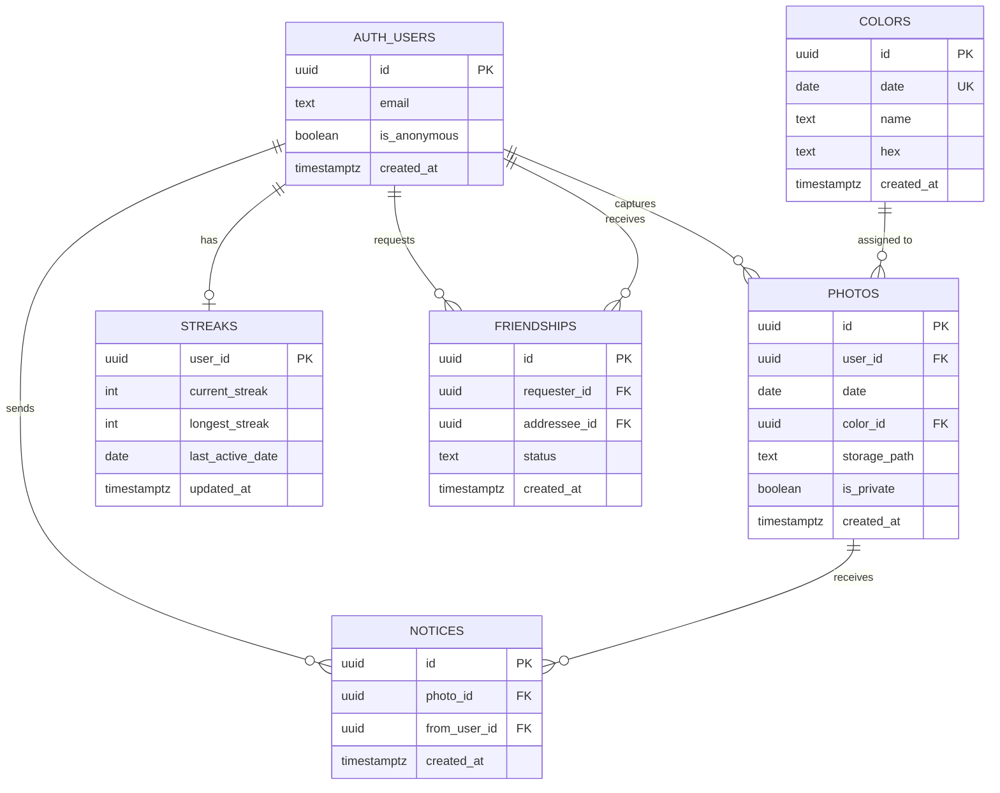

# Mosaic - Database Documentation

> Supabase (Postgres) backend. All tables use Row-Level Security. Phase 1 tables are live from day one; Phase 2 tables are created in the same migration but remain inert until the social layer ships.

---

## Entity Relationship Diagram



---

## Tables

### `colors` - Daily color assignments

Pre-seeded. One row per calendar date. Never written to by the app at runtime.

| Column | Type | Constraints | Description |
|---|---|---|---|
| `id` | `uuid` | PK, default `gen_random_uuid()` | Unique color record ID |
| `date` | `date` | UNIQUE, NOT NULL | Calendar date this color is assigned to |
| `name` | `text` | NOT NULL | Human-readable name e.g. `Coral`, `Forest Green` |
| `hex` | `text` | NOT NULL | Hex code e.g. `#E8735A` |
| `created_at` | `timestamptz` | default `now()` | Record creation timestamp |

**Notes:**
- No RLS writes - this table is read-only for all app users.
- Colors are seeded from `supabase/seeds/colors.sql` (generated by `supabase/seed.js`).
- The palette cycles through 12 colors in a seeded-shuffle order so the same color never repeats on back-to-back days.
- 3 years of dates are pre-seeded (2025-01-01 → 2027-12-31).

---

### `photos` - User-captured photos

One row per photo. Created on upload; never updated. Soft-deleted via RLS (users can only delete their own rows).

| Column | Type | Constraints | Description |
|---|---|---|---|
| `id` | `uuid` | PK, default `gen_random_uuid()` | Unique photo ID |
| `user_id` | `uuid` | FK → `auth.users(id)` ON DELETE CASCADE, NOT NULL | Owner of the photo |
| `date` | `date` | NOT NULL | The calendar day this photo was captured for |
| `color_id` | `uuid` | FK → `colors(id)`, NOT NULL | The color assigned on that day |
| `storage_path` | `text` | NOT NULL | Path in Supabase Storage bucket e.g. `{user_id}/{date}/{photo_id}.jpg` |
| `is_private` | `boolean` | default `true` | Phase 2 sharing toggle - private by default |
| `created_at` | `timestamptz` | default `now()` | Upload timestamp |

**Indexes:**
```sql
create index photos_user_date on photos(user_id, date);
```

**Notes:**
- **Phase 1 stores nothing here.** Photos are device-only; a row exists in this table only in Phase 2, and only when the photo is public or backup is enabled. The owner's grid/day views read from local storage.
- `date` is the *intended* day (the user's current calendar date at capture), **not** the upload timestamp, and is the grouping key for the grid. A photo shot at 11:58 PM and synced after midnight still belongs to the 11:58 PM day.
- `created_at` is the capture instant (UTC) and is the *ordering* key within a day. Grouping is always by `date`, ordering by `(created_at ASC, id ASC)`, so restores never mix days or reorder.
- `storage_path` format: `{user_id}/{date}/{photo_id}.webp` - mirrors the Storage bucket structure.
- `is_private` defaults true. A photo is in the cloud iff `is_private = false` (shared) **or** the user enabled backup. See the project doc's Cloud Sync, Backup & Privacy Model.

---

### `streaks` - Per-user streak tracking

One row per user. Upserted by an Edge Function on every successful photo upload.

| Column | Type | Constraints | Description |
|---|---|---|---|
| `user_id` | `uuid` | PK, FK → `auth.users(id)` ON DELETE CASCADE | One row per user |
| `current_streak` | `integer` | default `0` | Consecutive days with at least one photo |
| `longest_streak` | `integer` | default `0` | All-time best streak |
| `last_active_date` | `date` | nullable | Last date the user uploaded a photo |
| `updated_at` | `timestamptz` | default `now()` | Last streak update time |

**Streak logic:**
- If `last_active_date` = yesterday → `current_streak + 1`
- If `last_active_date` = today → no change (idempotent, already counted)
- Otherwise → reset `current_streak` to `1`
- `longest_streak` = `MAX(longest_streak, current_streak)` on every update

---

### `friendships` - Friend relationships *(Phase 2)*

Bidirectional friendship model. A friendship requires two rows only when accepted. Querying either direction uses a `requester_id = X OR addressee_id = X` condition.

| Column | Type | Constraints | Description |
|---|---|---|---|
| `id` | `uuid` | PK, default `gen_random_uuid()` | Unique friendship record |
| `requester_id` | `uuid` | FK → `auth.users(id)` ON DELETE CASCADE, NOT NULL | User who sent the request |
| `addressee_id` | `uuid` | FK → `auth.users(id)` ON DELETE CASCADE, NOT NULL | User who received the request |
| `status` | `text` | CHECK `('pending','accepted','declined')`, NOT NULL | Current state of the friendship |
| `created_at` | `timestamptz` | default `now()` | When the request was sent |

**Unique constraint:** `(requester_id, addressee_id)` - prevents duplicate requests.

**Status transitions:**
```
pending → accepted   (addressee accepts)
pending → declined   (addressee declines)
accepted → (deleted) (either party unfriends)
```

---

### `notices` - Quiet reactions *(Phase 2)*

A single, non-public reaction to a shared photo. Not a like count - not displayed as a number.

| Column | Type | Constraints | Description |
|---|---|---|---|
| `id` | `uuid` | PK, default `gen_random_uuid()` | Unique notice ID |
| `photo_id` | `uuid` | FK → `photos(id)` ON DELETE CASCADE, NOT NULL | Photo that was noticed |
| `from_user_id` | `uuid` | FK → `auth.users(id)` ON DELETE CASCADE, NOT NULL | Who noticed it |
| `created_at` | `timestamptz` | default `now()` | When the notice was sent |

**Unique constraint:** `(photo_id, from_user_id)` - one notice per user per photo.

---

## Row-Level Security Policies

All tables have RLS enabled. Anonymous users (`is_anonymous = true`) have the same data access as named users - they own their photos and streaks from day one.

| Table | Policy | Rule |
|---|---|---|
| `colors` | `colors public read` | `SELECT` - `USING (true)` - anyone can read |
| `photos` | `own photos` | `ALL` - `USING (auth.uid() = user_id)` |
| `streaks` | `own streaks` | `ALL` - `USING (auth.uid() = user_id)` |
| `friendships` | *(Phase 2)* | Requester or addressee can read; only addressee can update status |
| `notices` | *(Phase 2)* | Photo owner can read; sender owns their notice |

---

## Storage

**Bucket:** `photos` (private) — **Phase 2 only**; empty in Phase 1.

```
photos/
└── {user_id}/
    └── {date}/             e.g. 2026-05-31/
        ├── {photo_id}.webp
        └── {photo_id}.webp
```

**Storage RLS:**
- Users can upload, read, and delete only within their own `{user_id}/` prefix.
- Storage policy mirrors the DB `photos` RLS - consistent access model at both layers.
- The bucket is private; friends view shared photos through short-lived signed URLs.
- A file is uploaded only when the photo is public or backup is enabled; unpublishing a photo with backup off deletes it from here.

---

## Supabase Auth Setup

| Setting | Value |
|---|---|
| Anonymous sign-in | **Enabled** |
| Email / magic link | Enabled *(Phase 2)* |
| Password auth | Disabled |
| Session persistence | AsyncStorage (React Native) |

Anonymous sessions are real Supabase sessions - they have a `user_id` (UUID), own their photos and streaks, and survive app restarts. When the user creates a named account in Phase 2, `linkIdentity()` attaches their email to the same anonymous user - no data migration needed.

---

## Migrations

| File | Description |
|---|---|
| `migrations/001_initial_schema.sql` | Full schema - all tables, indexes, RLS policies |

Run in the Supabase SQL editor, or via the Supabase CLI:
```bash
supabase db push
```

---

## Seed Data

| File | Description |
|---|---|
| `seed.js` | Generator script - run once to produce `seeds/colors.sql` |
| `seeds/colors.sql` | 3 years of daily color assignments (2025–2027) |

Regenerate:
```bash
node supabase/seed.js
```

Apply seed:
```bash
# Paste contents of seeds/colors.sql into the Supabase SQL editor, or:
supabase db seed
```

---

## Key Queries

### Get today's color
```sql
SELECT id, name, hex FROM colors WHERE date = CURRENT_DATE;
```

### Get all photos for a user on a date
```sql
SELECT * FROM photos
WHERE user_id = auth.uid() AND date = '2026-05-31'
ORDER BY created_at ASC;
```

### Get grid data (all days with color + photo presence)
```sql
SELECT
  c.date, c.hex, c.name,
  EXISTS (
    SELECT 1 FROM photos p
    WHERE p.user_id = auth.uid() AND p.date = c.date
  ) AS has_photos
FROM colors c
WHERE c.date BETWEEN '2026-01-01' AND CURRENT_DATE
ORDER BY c.date ASC;
```

### Upsert streak on photo upload
```sql
INSERT INTO streaks (user_id, current_streak, longest_streak, last_active_date, updated_at)
VALUES (auth.uid(), 1, 1, CURRENT_DATE, now())
ON CONFLICT (user_id) DO UPDATE SET
  current_streak = CASE
    WHEN streaks.last_active_date = CURRENT_DATE - 1 THEN streaks.current_streak + 1
    WHEN streaks.last_active_date = CURRENT_DATE      THEN streaks.current_streak
    ELSE 1
  END,
  longest_streak = GREATEST(streaks.longest_streak,
    CASE
      WHEN streaks.last_active_date = CURRENT_DATE - 1 THEN streaks.current_streak + 1
      ELSE 1
    END),
  last_active_date = CURRENT_DATE,
  updated_at = now();
```

---

*Mosaic Database Documentation · Phase 1 & 2 · Last updated 2026-05-31*
